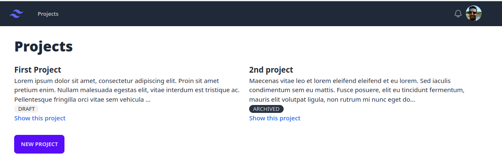

# homey-test

Tech test for Homey.co.uk

### Questions

The questions are in [questions.MD](questions.MD)

### Next steps

- add gem "omniauth-google-oauth2" so that it would automatically pull the avatar for each account created. As it stands, the avatars are just placeholders.
- Fix the #messages container is currently too tall, as its height set is to `h-screen`

### Screenshots

